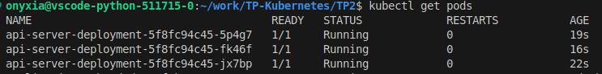
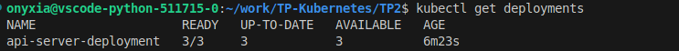
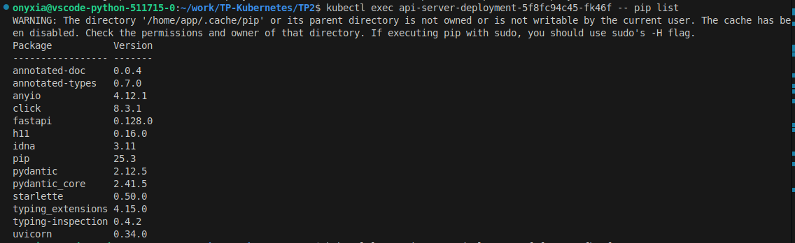

# Compte rendu du TP2

J'ai utilisé la structure de code présente dans les slides du cours pour écrire le manifest *deployment.yaml*. 
Je n'ai pas eu de difficuluté particulière pour lancer les différents pods si ce n'est le fait que dans notre cas il n'y a pas besoin d'avoir des arguments (il fallait donc supprimer args). 
Ensuite j'ai effectué les différentes commandes demandées pour avoir les informations de fonctionnement sur mes pods. 

## Afficher la liste des pods

## Afficher la liste des deployments

## Regarder les logs de l'application avant et après test

## Lister les dépendances de l'application

## Récupérer une description complète de votre application

## Execution de l'API en passant par curl (puisque j'ai pris la version complete de python 1.13 dans mon image docker)

